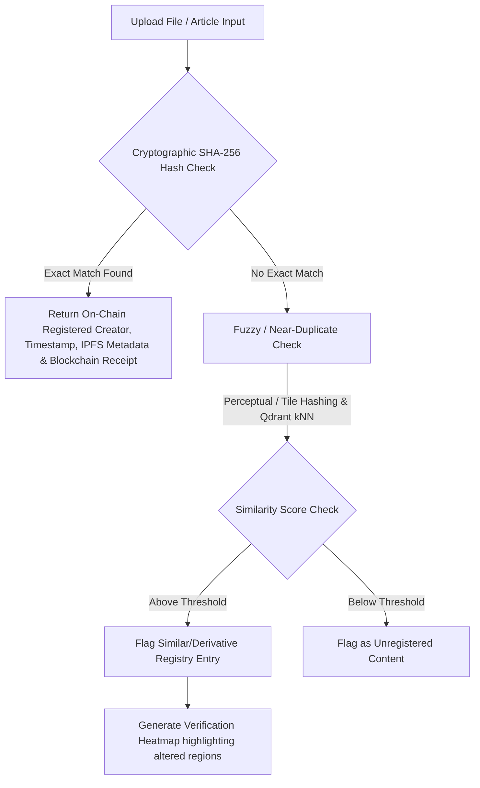
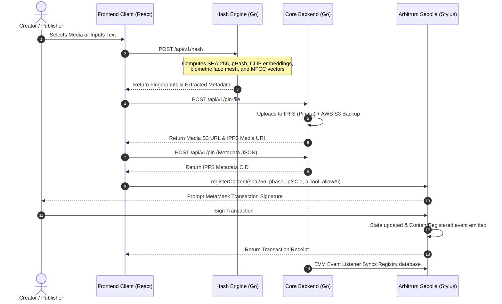

# VeriTrace Frontend

VeriTrace is a decentralized content authenticity registry and similarity search engine designed to restore trust in digital media. This repository contains the React frontend client, which coordinates local feature fingerprinting, decentralized storage pinning, and Web3 anchoring on the Arbitrum Sepolia network.

---

## 📖 Project Overview

### Problem Understanding

The core problem statement that **VeriTrace** addresses consists of four main challenges:

#### 1. The Rise of Generative AI & Deepfakes
With the proliferation of sophisticated generative AI models, creating high-quality synthetic media (deepfakes, AI-generated images, videos, audio, and documents) has become trivial. As a result, consumers, publishers, and platforms can no longer easily distinguish between authentic original content, modified derivatives, and completely synthetic deepfakes.

#### 2. Loss of Authorship & Metadata Stripping
Standard digital files rely on file metadata (such as EXIF data) to store authorship and origin details. However, content platforms and social media networks automatically strip this metadata upon upload. Once stripped, there is no way to verify who created the media, what tools were used, or if the content has been altered.

#### 3. Limitations of Traditional Cryptographic Hashing
Traditional cryptographic hash algorithms (like SHA-256) are hyper-sensitive to single-bit changes. If an image is slightly compressed, resized, or cropped:
* Its exact SHA-256 hash changes completely.
* Traditional exact-match detection engines fail to recognize it.
* Stolen or altered derivatives easily evade copyright registry systems.

#### 4. High Transaction Costs & Centralization Risks
* **Centralization**: Web2 registry databases are single points of failure, vulnerable to tampering, database deletion, or service shutdown.
* **Cost**: Anchoring media hashes directly on Layer-1 blockchains (like Ethereum) is prohibitively expensive for creators who produce and upload hundreds of media files daily.

---

### Target Stakeholders

| Stakeholder | Pain Point |
| :--- | :--- |
| **Journalists & News Organizations** | Cannot verify whether a submitted photo or video is authentic before publishing. |
| **Social Media Platforms** | Struggling to label AI-generated content at scale across millions of daily uploads. |
| **Governments & Election Bodies** | Deepfake political advertisements threaten election integrity and public trust. |
| **Content Creators** | Original work is increasingly confused with AI-generated fakes, undermining portfolio credibility. |
| **General Public** | Diminishing ability to trust what they see or hear online. |

---

### Solution Overview & Core Features

VeriTrace acts as a content provenance registry — a birth-certificate system for digital files:
1. **Fingerprint**: Generate a unique digital signature for the content using a cryptographic hash (exact match) and a perceptual hash (near-duplicate / "looks-like" match).
2. **Record**: Anchor the fingerprint, creator identity, timestamp, and metadata pointer on a public, tamper-evident ledger that cannot be altered after the fact.
3. **Verify**: Anyone can later upload a file and check whether it matches a registered entry, who registered it, and whether it has since been modified.

#### Key Features Matrix

| # | Feature | Description |
| :--- | :--- | :--- |
| **1** | **Content Registration** | Upload a file, generate its fingerprint, and anchor it on-chain on Arbitrum Sepolia. |
| **2** | **Content Verification** | Upload a file and check whether it matches a registered entry, with full provenance details. |
| **3** | **Tiled Perceptual Matching** | Image is split into a grid of tiles, each independently hashed, so near-duplicate checks can pinpoint exactly which regions were changed. |
| **4** | **Verification Heatmap** | Renders a visual overlay highlighting the specific altered regions of a modified file. |
| **5** | **Multi-Media Support** | Fingerprinting and verification extended across images, video, audio, and documents (PDF/DOCX/TXT). |
| **6** | **AI-Tool Tagging** | Content can be tagged with the AI tool used to generate it, as declared by the uploader (supported with AI score checks). |
| **7** | **REST API** | Clean API endpoints covering registration, verification, and lookup operations. |
| **8** | **Web Dashboard** | Interface to register, verify, and browse the content registry (this repository). |
| **9** | **Browser Extension** | In-page verification of images encountered while browsing, without a manual upload step. |

---

## 🏗️ On-Chain & Off-Chain Design

The registry lives on **Arbitrum Sepolia** rather than a custom or private ledger. This guarantees tamper-evidence (nothing recorded on-chain can be silently altered) while building on existing, audited infrastructure instead of reinventing consensus. A user registers content by signing the on-chain transaction with their own wallet, so the chain's record of "who created this" reflects the actual creator — not a shared backend key.

* **On-Chain**: Stored in the WASM-based Rust Stylus contract (`VeritraceRegistry`). Holds the exact cryptographic SHA-256 hash (`bytes32`), creator address, timestamp, a pointer to the off-chain IPFS metadata JSON (`ipfs_cid`), declared AI tool, and training configuration.
* **Off-Chain**: Perceptual hashes and similarity search — which require comparing a new upload against many existing entries — are handled off-chain by the Go Hash Engine, Qdrant Vector database, and PostgreSQL database, since fuzzy matching is not practical inside a smart contract.

### Verification Flow Architecture



---

## 📁 System Sequence Flow



---

## 🌊 Application Flow Walkthroughs

### 1. Registration Flow
A creator registers content in a 4-step wizard:
* **Upload**: File selected locally (or text entered directly and virtualized as an `article.txt` blob).
* **Fingerprinting**: Client calls the Go Hash Engine (`/api/v1/hash`) to generate the media fingerprints.
* **Attribution**: Creator declares if the content is authentic or AI-generated. If AI-detection confidence exceeds 75%, selection of the generating model (e.g. Midjourney, GPT-4o) is enforced. Options to opt-in/out of AI training and register a webhook notification endpoint are provided.
* **On-Chain Anchor**: Media is pinned to IPFS and S3. Metadata JSON is compiled and pinned to IPFS. The client triggers the `registerContent` write function on the `VeritraceRegistry` contract. A PDF certificate containing signatures, block timestamp, and hashes is downloadable upon transaction confirmation.

### 2. Verification Flow
Verifiers inspect files to check ownership and authenticity:
* **Cryptographic Matching**: Calculates the file's SHA-256 hash in the browser and queries the smart contract via `verifyContent`. If registered, the smart contract instantly verifies the original creator, block timestamp, and metadata.
* **Database Exact Matching**: Resolves the hash against the index database via `GET /api/v1/verify/exact?hash=` to retrieve full backend logs.
* **Fuzzy & Segment Search**: If an exact match is missing, the client queries the backend's `/api/v1/verify/segments` endpoint. The backend uses Qdrant Vector search (for CLIP/ArcFace embeddings) and Hamming distance indexes (for pHashes) to spot visual alterations, edited segments, or audio swaps, returning similar registered items.

### 3. Enterprise Licensing & Publisher Attestation
* **Dataset licensing Market**: AI developers query the index database on the `Enterprise` page (filtering by media type, quantity, and semantic query). The frontend retrieves creator payouts and total costs. The developer executes `purchaseDatasetAccess(token, creators, amounts, total_usdc)` on-chain, which performs automated payouts to creators' wallet addresses. High-resolution media S3 links are unlocked once the backend verifies transaction confirmation.
* **Verified Publisher Network**: Publishers declare authenticity of high-profile media. To prevent wallet spoofing, publishers host a metadata file (`veritrace.json`) under their domain at `https://[publisher-domain]/.well-known/veritrace.json`. When requesting domain attestation on-chain, the backend validates that the registered creator wallet controls the domain, binding their identity in the registry.

---

## 🖼️ Media Hashing & Feature Pipelines

VeriTrace adapts its fingerprint extraction depending on the media type to protect against specific editing attacks:

| Media Type | Extraction Pipeline | Target Attack Prevention |
| :--- | :--- | :--- |
| **Photos / Images** | SHA-256, 64-bit DCT pHash, 512-D CLIP Embedding, ArcFace 128-D Biometric Mesh | Rotation, resizing, color filter changes, style transfers, image compositions, and face swaps. |
| **Videos** | Temporal Keyframe sampling, per-keyframe pHash, Face Topology, and MFCC Audio Waveform analysis | Frame insertion/deletion, sequence rearrangement, visual deepfakes, and audio voice cloning. |
| **Documents (PDF, Docx, TXT)** | SHA-256 cryptographic check, virtualization of plaintext article text inputs | Word modifications, formatting adjustments, and plagiarized text compositions. |

---

## 🛠️ Technology Stack Detail

* **Client Engine**: React 19 (SPA), Vite, Javascript
* **Web3 Integration**: [ethers.js](https://github.com/ethers-io/ethers.js/) v6, [Wagmi](https://github.com/wevm/wagmi) v3, [Viem](https://github.com/wevm/viem) v2
* **Wallet Connector**: MetaMask (Injected provider)
* **Styling & UI**: Tailwind CSS v4, custom HSL styling tokens, glassmorphic layout, [Framer Motion](https://github.com/framer/motion) micro-animations
* **Routing**: React Router DOM v7
* **PDF Utility**: `jsPDF` for certificate generation

---

## ⚙️ Configuration & Environment Variables

Configurations are managed in:
👉 [`src/config.js`](file:///Users/dhruvilpatel/Developer/Veritrace-Frontend/src/config.js)

### Supported Environment Variables
You can configure the help widget's API endpoint:
* `VITE_RAG_BOT_API`: Endpoint for the RAG-based AI chat assistant (Default: `https://rag-bot-1-15kz.onrender.com`)

### Connected Endpoints (Production Fallbacks)
* **Hash Engine API**: `https://api.hash.veritrace.dpkvtrading.online` (Go, BoltDB feature extraction)
* **Core Backend API**: `https://api.veritrace.dpkvtrading.online` (PG, Redis, Qdrant orchestration)
* **Smart Contract Address**: `0xa7bcdc220f17ebcb41a2ddded82c0317a9954c48` (Arbitrum Sepolia Testnet)

---

## 🚀 Setup & Local Installation

### Prerequisites
* [Node.js](https://nodejs.org/) v18 or higher
* [MetaMask Wallet Extension](https://metamask.io/) configured for the **Arbitrum Sepolia Testnet**
* Some Arbitrum Sepolia test ETH for gas. Get tokens from the [Lampros DAO Faucet](https://faucet.lamprosdao.com/).

### Installation

1. Clone the repository and navigate to the directory:
   ```bash
   cd Veritrace-Frontend
   ```

2. Install the package dependencies:
   ```bash
   npm install
   ```

3. Run the development server locally:
   ```bash
   npm run dev
   ```
   The application will be served at `http://localhost:5173`.

4. Build production bundle assets:
   ```bash
   npm run build
   ```

---

## 🧪 Testing & Validation Guide

1. **Connect Wallet**: Click the "Connect Wallet" button on the navigation bar. If MetaMask is not configured, it will prompt to connect. Ensure your network is set to **Arbitrum Sepolia**.
2. **Register a File**:
   * Navigate to `/register`.
   * Drag and drop an image or video file.
   * Review the extracted SHA-256 and pHash fingerprints.
   * Click **Register on Blockchain**, confirm the transaction in MetaMask, and wait for confirmation.
   * Click **Download PDF Certificate** to verify the signature report generation.
3. **Verify the File**:
   * Navigate to `/verify`.
   * Upload the same file. It should return a **100% Cryptographic Match** registered by your address.
   * Edit the file slightly (e.g. crop or compress it) and re-upload. The page should flag the original owner, show a **Derivative Match**, and outline the similarity confidence score.
4. **Test Enterprise Datasets**:
   * Navigate to `/enterprise`.
   * Search for a media dataset (e.g., query "video" or "image" and input a semantic prompt).
   * Pay using mock Sepolia USDC to unlock high-res URL files on AWS S3.

